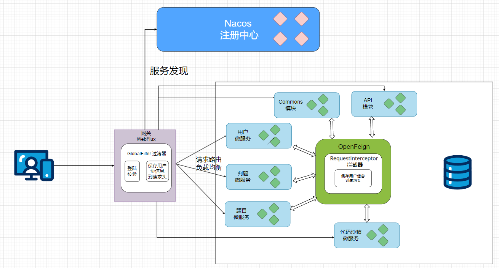
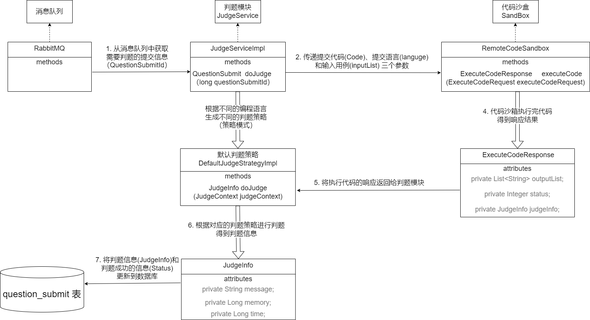
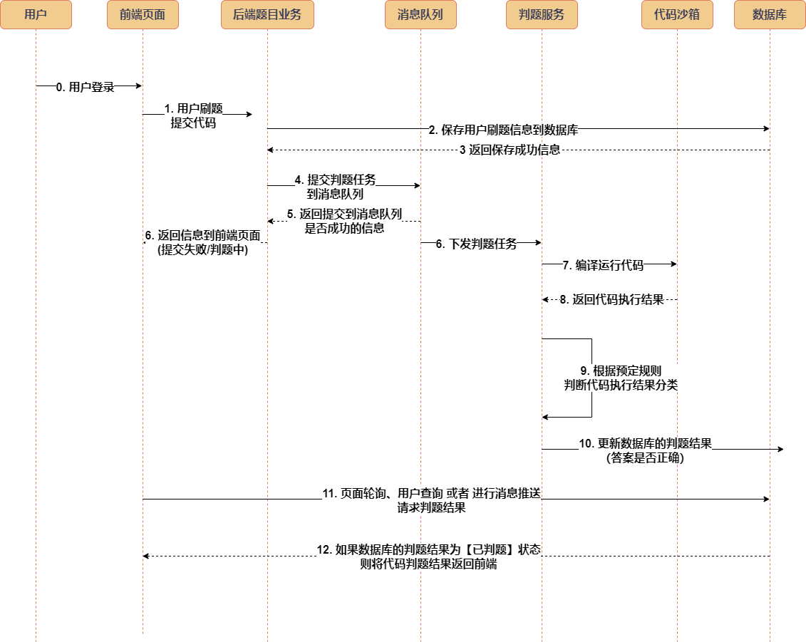
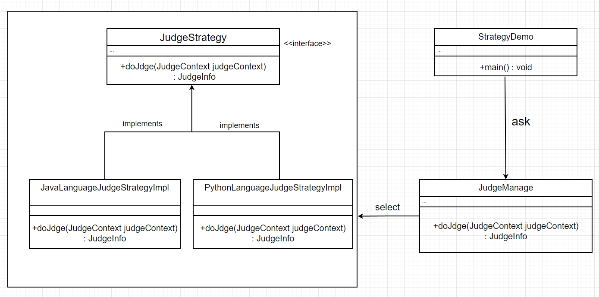
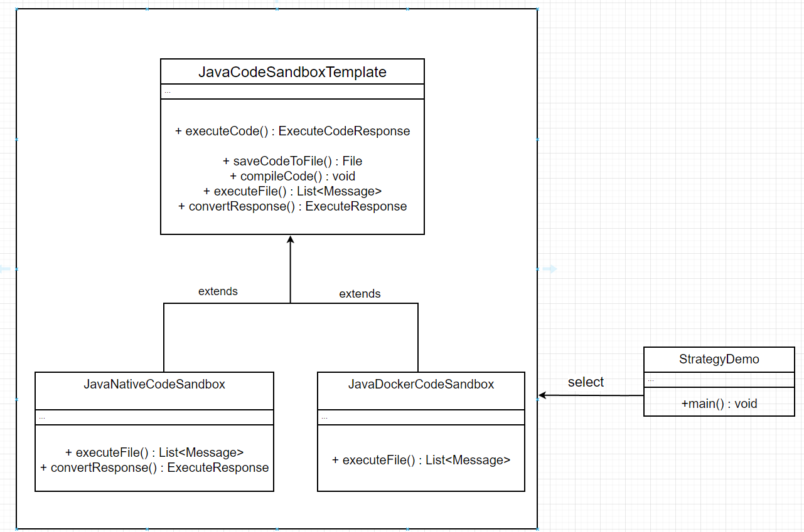

# OJ - 判题评测云（微服务）

## 系统架构




### 判题模块、代码沙盒的关系



### 时序图



### 判题模块-策略模式



### 代码沙箱 - 模板方法模式


## 使用说明

1. 将本微服务项目部署在服务器上，需要先安装 docker compose V2.0

参考官方文档：
> Docker Compose Linux 安装：
> https://docs.docker.com/compose/install/linux/#install-using-the-repository


2. 安装完docker compose之后

安装 maven 进行项目打包

```shell
sudo apt install maven
```

然后在**项目根目录**进行项目打包 (如果打包速度过慢，就在setting.xml中切换国内镜像)

```shell
sudo mvn package
```

3. 执行命令安装项目环境：mysql、redis、nacos、rabbitMQ

```shell
sudo docker compose -f docker-compose.env.yml up -d
```

4. 再将项目制作成镜像 并发布：

   由于进程在前台启动会影响我们的操作，所以加上 -d 参数让容器在后台启动：

```shell
docker compose -f docker-compose.service.yml up -d
```

5. 试着查看下 docker 容器的状态，能够查看到所有容器的资源占用情况：
```shell
sudo docker stats
```
6. 如果某个服务启动失败，可以再次单独只启动它，比如网关服务：
```shell
sudo docker compose -f docker-compose.service.yml up evaluate-gateway
```
